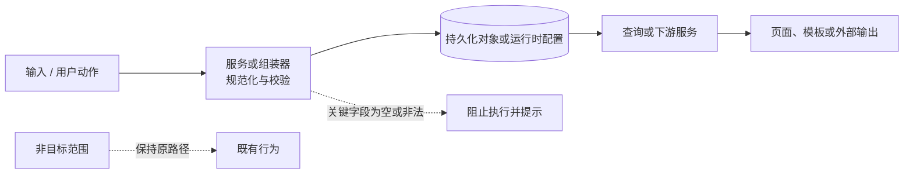

# Mermaid 审核图规范

> 目的：对跨层、跨模块或多状态业务变更，将“计划中的数据流与完成后的实现”用同一张 Mermaid 图进行可审查、可追溯的核对。

## 适用条件

满足任意一项时，应在 Trellis 任务中生成 Mermaid 审核图：

- 改动跨越 3 个及以上层级、服务或运行时配置边界。
- 业务数据经历“输入 -> 保存 -> 查询 -> 组装/转换 -> 展示/输出”等 3 个及以上步骤。
- 涉及状态流转、异步处理、批量处理、回滚路径或多个分支。
- 文字计划无法清楚说明责任归属、数据来源或验收顺序。

单文件、小范围、没有分支的一步改动不必为了形式创建图。

## 存放与引用

1. 在任务目录根目录创建 `review-<主题>.md`，例如 `review-dispatch-label-flow.md`。
2. 使用标准 Markdown Mermaid 代码块；不创建 HTML、图片或二进制附件。
3. 从 `design.md` 链接审核图；如图覆盖实施顺序或验收边界，也从 `implement.md` 链接。
4. 图中的节点名称使用稳定的业务对象、方法、QueryID、表或配置名，避免“步骤一”“处理数据”等无语义名称。
5. 图和计划出现冲突时，以经过用户确认的 `prd.md/design.md/implement.md` 为准，并同步修正另一方。

## 图的最小内容

每张审核图必须表达：

- 起点：用户动作、外部输入、定时任务或已有数据来源。
- 边界：服务、前端、数据库、QueryID、配置或外部系统之间的责任分隔。
- 关键载体：至少标出会跨边界的关键字段、表、事件或快照。
- 终点：用户可见结果、持久化结果、打印/外发结果或状态变化。
- 失败分支：至少标出会阻止继续执行的关键校验或错误结果。
- 范围外或已接受风险：不要伪装成已实现能力，应以虚线、注释或图后的清单明确标出。

## 推荐写法

约定：

- 使用 `flowchart LR` 表达主数据流；状态或时间顺序更重要时使用 `stateDiagram-v2` 或 `sequenceDiagram`。
- 实线箭头表示正常数据/控制流；虚线箭头只表示异常、范围外或已接受风险。
- 跨层节点建议使用换行说明层级与职责，例如 `MES_UI\\n打印前校验`。
- 节点数量以能让评审者一次看清主路径为准；复杂分支应拆为“主流程图 + 子流程图”，不要堆成不可读的大图。

## 审核对照表

审核图后必须附一个对照表，将关键边与可验证事实绑定：

| 图中边或节点 | 契约 / 责任 | 完成核对点 |
| --- | --- | --- |
| `A -> B` | 输入字段、格式与校验归属 | 合法、缺失、非法输入都有测试。 |
| `B -> C` | 保存或状态更新的对象与字段 | 数据持久化和回读结果一致。 |
| `C -> D` | 查询关联键、排序、版本或过滤规则 | 不串值，边界记录覆盖。 |
| `D -> E` | 输出变量、页面字段或模板绑定 | 最终展示/打印/外发值可核对。 |
| 异常分支 | 阻断条件、用户提示和副作用 | 不产生不应产生的状态或序列。 |

## 评审与完成门槛

规划阶段：

- [ ] 用户已审阅图中的主路径、关键异常分支和范围外事项。
- [ ] `design.md`、`implement.md` 与图的边界和术语一致。

实施完成后：

- [ ] 按图逐边核对代码、QueryID、配置和数据落点。
- [ ] 对照表中的每个完成核对点都有测试、运行记录或人工验证证据。
- [ ] 图中未实现的节点、分支或风险已删除、标记为范围外，或回到规划阶段处理。
- [ ] `trellis-check` 的跨层检查引用本图，确认没有绕过图中定义的责任边界。

## 常见错误

- 只画技术组件，不写字段、表、QueryID 或可观察输出，导致无法验收。
- 将计划中的功能与已实现功能混在同一条实线流程中。
- 把失败后的人工处理、回滚或已接受风险省略，造成评审误判。
- 图独立存在但没有被 `design.md`、`implement.md` 引用，后续实施无法找到它。
