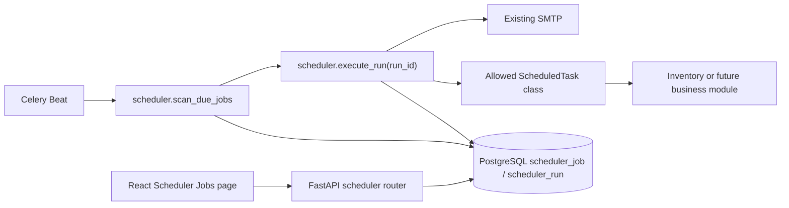

# 定时任务管理系统设计

## Terms and boundaries

| Term | Meaning |
| --- | --- |
| Task definition | 管理员维护的可启停配置，包含类路径、Cron、JSON 配置和审计字段。 |
| Run | 一次不可变的执行请求，保存定义在创建时的快照和最终技术状态。 |
| Scheduled occurrence | Cron 在上海时区匹配的一个分钟时点。 |
| Active run | 状态为 `QUEUED` 或 `RUNNING` 的运行。每个定义最多一个。 |
| Skip | 已知未执行的终态，例如错过计划、重叠或日报窗口过期。 |

模块所有权为新的 `scheduler` 后端模块，数据库命名空间固定为 `scheduler_`。它不管理
业务规则、业务重试或凭据；这些继续由被调度的业务模块负责。

## Architecture

- Beat 只保留三个固定计划：既有每日测试邮件、每分钟扫描、每日 03:30 上海时间清理。
  库存日报创建和投递重试的固定 Beat 条目删除。
- 所有 Celery 任务在默认队列执行；扫描器和运行器只传递运行 ID 或无参数。不得传递 ORM、
  配置对象、用户对象或凭据。
- 运行器不创建通用业务重试。Celery 因进程丢失重投同一 `run_id` 时，基于租约重领并可能
  再次调用业务实现，这是现有至少一次语义；业务实现必须自身幂等。

## Persistent model

### `scheduler_job`

用户维护的任务定义，使用 BIGINT generated-always identity 和完整 audit fields。建议字段：

| Field | Contract |
| --- | --- |
| `id` | BIGINT identity primary key。 |
| `name` | 管理页显示名称，1..128 字符；不是业务主键，允许同名。 |
| `class_path` | 受限完整 Python 类路径，最长 255。 |
| `cron_expression` | 原始五段 Cron，最长 128。 |
| `config` | 已校验 JSONB，仅允许无凭据数据。 |
| `enabled` | 自动扫描开关，默认 `false`。 |
| `next_run_at` | UTC `TIMESTAMPTZ`，停用时仍保留下一个候选时点。 |
| `bootstrap_key` | 可空、仅内部写入的稳定键；库存两条内建任务使用它，以便初始化幂等而不覆盖人工编辑。 |
| `run_failure_alerted_at` / `overlap_alerted_at` / `configuration_alerted_at` | 三类固定告警的最后投递时间；避免新增通用告警状态表。 |
| Audit fields | `created_at/by`、`updated_at/by`、`deleted_at`，与现有 `AuditFields` 一致。 |

- 需要一个扫描索引：未删除、启用定义按 `next_run_at` 查找；在迁移中显式命名为
  `ix_scheduler_job_ready`。
- `bootstrap_key` 具有唯一约束，管理员 API 不公开该字段；多个 `NULL` 值正常允许。
- 软删除服务在同一事务内设 `enabled=false`、`deleted_at` 与更新审计字段；恢复仅清除
  `deleted_at`、保持 `enabled=false` 并计算下一未来时点。

### `scheduler_run`

自动化技术记录，使用 BIGINT identity；不采用完整 audit fields，以免为自动运行伪造用户。

| Field | Contract |
| --- | --- |
| `id`, `job_id` | BIGINT identity 及对 `scheduler_job` 的 `RESTRICT` 外键。 |
| `status` | `QUEUED`、`RUNNING`、`SUCCEEDED`、`FAILED`、`SKIPPED`、`CANCELLED`。 |
| `trigger` | `SCHEDULED`、`MANUAL_NOW`、`MANUAL_BACKFILL`。 |
| `planned_at` | UTC 计划/业务参考时点；手工立即运行为请求当刻上海时间转换后的 UTC。 |
| `class_path`, `config` | 创建时冻结的值；不随定义编辑改变。 |
| `requested_by` | 手工运行的真实用户 UUID；自动运行为空。 |
| `created_at`, `started_at`, `finished_at` | UTC 技术时间。 |
| `lease_expires_at`, `attempt_count` | Worker 领取和崩溃重投的技术状态。租约使用现有 visibility timeout。 |
| `error_category`, `error_summary` | 受控错误类别和无敏感信息摘要，均不保存完整异常。 |

- 部分唯一索引 `uq_scheduler_run_job_active`：`job_id` 在 `QUEUED`/`RUNNING` 状态最多一条，
  是并发控制的数据库兜底。
- 建立 `ix_scheduler_run_job_created_at` 供历史分页，及 `ix_scheduler_run_finished_at` 供
  90 天清理。所有名称带 `scheduler_` 前缀。
- 运行不软删除。每日清理只删除 `finished_at < cutoff` 的终态记录；活动记录永不清理。

## Class contract and validation

`app.modules.scheduler.contracts` 定义最小抽象基类和不可变上下文：

- 每个实现类继承 `ScheduledTask`，声明 `config_model: type[BaseModel]`，其模型启用
  `extra="forbid"`。
- `run(context, config)` 接收 `run_id`、触发方式、`planned_at` 和实际 `started_at`；实现类
  自己创建业务 session 或调用已有业务服务。它不接收 ORM 定义或 HTTP 用户。
- `run` 正常返回即为成功；只有明确的 `ScheduledTaskSkipped` 受控结果才写入 `SKIPPED`，
  其他异常均映射为安全失败。库存日报在实际开始超过 08:15 时返回该受控结果。
- 类路径解析器先做严格正则/分段检查，再 `import_module`；只接受
  `app.modules.<module>.scheduled_tasks.<Class>`、`ScheduledTask` 子类和有效 Pydantic 模型。
- API 的保存/更新、Schema 查询和扫描/运行时均调用同一解析器。模块代码被部署代码信任，
  但用户配置永远不能控制 import 范围、函数名或表达式。
- JSON Schema 端点只返回已经通过同一受限解析器的 `config_model.model_json_schema()`；不提供
  类路径枚举或任意模块浏览。
- 快照前递归检查对象键：拒绝密码、token、secret、API key、DSN、connection string 及其
  常见下划线/连字符变体；声明 `SecretStr` 或其他凭据字段的配置模型同样拒绝。该规则保护
  持久化边界，不以猜测字符串内容替代实现类的环境凭据设置。

库存模块增加两个薄实现类：日报创建类把实际 `started_at` 传入现有
`create_daily_reports`，再排队投递；日报重试类复用现有 `queue_due_daily_report_deliveries`。
创建类因实际开始超过 08:15 返回“跳过”，不创建日报。

## Cron and scan behavior

- 解析器将恰好五个空白分隔字段映射到 Celery `crontab(minute, hour, day_of_month,
  month_of_year, day_of_week)`。Celery 的日/星期 AND 行为就是公开契约。
- Cron helper 以 `Asia/Shanghai` aware datetime 和 Celery `remaining_estimate` 计算严格下一
  时点，然后转换 UTC 存储。它不引入 `croniter` 或第二套 Cron 语义。
- 扫描时将当前时间截断到上海本地分钟。只有 `next_run_at` 对应这个分钟的定义可创建
  `SCHEDULED` run；过去分钟使用当前时间直接计算下一个未来时点，不创建补跑记录。
- 扫描在单个事务中锁定候选定义。类或配置无法重载时创建 `FAILED` run、记录安全类别、
  推进下一时点并按限频告警。已有活动运行时创建 `SKIPPED` run，类别为重叠，再推进。
- 对符合时点且无活动运行的定义，扫描创建 `QUEUED` run、推进 `next_run_at` 并提交，随后
  `delay(run_id)`。Broker 投递失败会由 Celery/日志暴露；持久 run 保留，扫描器绝不创建第二个
  活动 run。

## Run lifecycle

1. API 或扫描创建带冻结快照的 `QUEUED` run。
2. Worker 用 `SELECT ... FOR UPDATE` 读取 run：`CANCELLED` 直接返回；`QUEUED` 或租约过期的
   `RUNNING` 记录被领取，写入 `RUNNING`、实际开始时间、尝试数和新租约并提交。
3. Worker 运行受限实现类。失败时只映射为受控类别和泛化摘要；成功则写 `SUCCEEDED`。
   两者都写 `finished_at` 并清除租约。
4. `FAILED` 触发失败告警；`SUCCEEDED` 清除失败和重叠限频时间。运行器不重新排队失败业务。
5. 停用在锁内将该定义的 `QUEUED` run 标为 `CANCELLED`；正在执行的运行继续。

手工立即运行和补发走同一创建路径。补发要求：时间带时区、在过去、距离当前不超过 90 天、
按上海时区精确命中该定义 Cron；否则 API 返回 422。存在活动 run 时返回 409。

## Alerts and runtime settings

- 新增独立 `scheduler` settings，使用逗号分隔的 `SCHEDULED_TASK_ALERT_RECIPIENTS`，解析为
  去重 `EmailStr` 列表。它不写入核心 `Settings`，避免影响 HTTP API 启动。
- `celery.py` 在仅 Worker/Beat 会加载的路径调用调度运行时校验：非 `local` 要求
  `settings.emails_enabled` 和非空收件人，否则进程启动失败；`local` 允许缺失并输出安全日志。
- 告警直接使用现有 `send_email`。投递失败不改变原运行终态；记录既有 SMTP 安全日志，避免
  递归产生告警。邮件只包含任务名称/ID、类别、计划和安全摘要。
- 每项告警类型对应 `scheduler_job` 中的一个时间戳。少于一小时不投递；成功清理失败和重叠
  时间戳，有效 API 保存清理配置错误时间戳；不发送恢复邮件。

## API and authorization

所有路由在 `/api/v1/scheduler`，使用 `permission_required`：

| Endpoint | Permission | Behavior |
| --- | --- | --- |
| `GET /jobs`、`GET /jobs/{id}` | read | 默认不含软删除，offset 分页 `{data,count}`。 |
| `POST /jobs`、`PUT /jobs/{id}` | manage | 严格校验类路径、Cron 和 JSON；新建默认停用。 |
| `POST /jobs/{id}/enable`、`/disable` | manage | 启用计算下一未来时点；停用取消排队 run。 |
| `DELETE /jobs/{id}`、`POST /jobs/{id}/restore` | manage | 软删除/恢复；有活动 run 删除返回 409。 |
| `POST /jobs/{id}/run-now`、`/backfill` | manage | 返回新 run；补发验证 90 天和 Cron 命中。 |
| `GET /jobs/{id}/runs` | read | 分页运行历史及安全快照。 |
| `GET /task-schema?class_path=...` | read | 返回受限类的 Pydantic JSON Schema。 |

缺失或软删除定义返回 404；无权限返回 403；活动运行冲突返回 409；格式、Cron、类、配置和
补发时点错误返回 422。Create/update DTO 禁止 `id`、audit、`bootstrap_key` 和任何未声明字段。

## Frontend

- 新建 `/scheduler/jobs` 受 `scheduler.jobs.read` 路由守卫，侧栏仅对该权限用户显示“定时任务”。
- 页面使用现有 Ant Design server-side Table、offset 分页与 React Query；任务表展示名称、类、
  Cron、启用状态、下一时点和最近状态。
- 管理权限决定新建、编辑、开关、执行、补发、删除和恢复动作是否可见。图标按钮带 tooltip；
  删除和补发使用确认对话框。
- 新建/编辑使用任务局部 Modal：类路径、Cron、JSON 文本、启用开关；输入类路径后可请求
  Schema，并在服务端错误处显示字段错误。不会实现动态表单或 Cron 预览。
- 运行历史放在同页抽屉或 Modal，以独立分页请求展示状态、触发方式、计划/开始/结束时间、
  安全摘要和请求人；不渲染完整配置以外的业务输出。

## Initialization, migration, and rollback

- Alembic 迁移创建 `scheduler_` 枚举、两表、外键、检查/唯一/部分唯一约束和索引；降级按
  run、job、enum 的依赖反向移除。模型统一由 `app.models` 导出。
- `init_db` 在 IAM bootstrap 成功后调用 scheduler bootstrap，传入刚解析的真实
  `FIRST_SUPERUSER`。bootstrap 用 `bootstrap_key` 仅插入缺失的两条库存定义，绝不覆盖已有行。
- 部署顺序维持现有模式：`alembic upgrade head`，再运行 `python app/initial_data.py`，最后启动
  HTTP、Worker 和 Beat。无需新增 PM2 进程；现有 Worker/Beat 加载 scheduler tasks 即执行配置
  前校验。
- 回滚前必须停止 Worker/Beat，避免旧代码读取新表；降级会删除调度数据，因此仅在明确接受
  丢失新任务配置和运行历史时执行。
