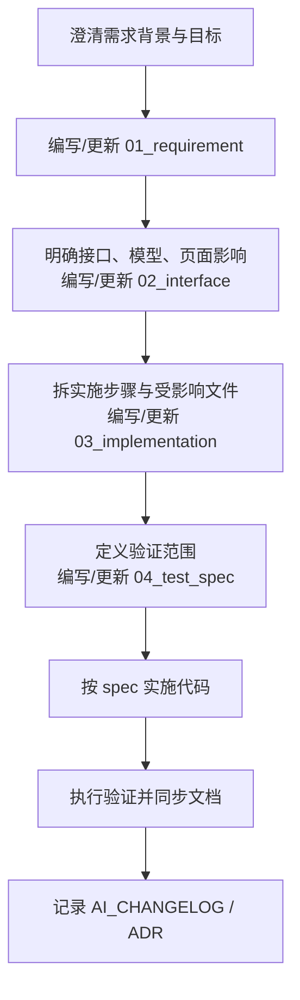

# 需求宪章

## 总体定位

本宪章用于规范当前仓库的需求确认阶段。

它回答的是：

- 需求文档应该怎样组织
- 哪些信息必须在开发前澄清
- 需求、接口、实现、测试文档怎样协同
- 何时需要完整 spec，何时可以走轻量流程

本宪章是原则文件；具体写法与模板见 [需求规则.md](D:/Workspace/full-stack-fastapi-template/docs/rules/需求规则.md)。

## 生效范围

- 所有非平凡功能开发
- 明显影响接口、数据库、前端页面、关键流程或测试策略的改动
- 需要跨前后端协作或后续复盘的需求

以下场景可以走轻量流程：

- 小范围 bugfix
- 纯文案调整
- 明确局部且低风险的文档修正

但即使走轻量流程，也应至少保证：

- 需求意图可追踪
- 关键决策有记录
- 相关文档不会与代码脱节

## 核心原则

### I. 需求文档以 `docs/specs/<feature>/` 为主结构

当前仓库的需求文档主结构固定为：

- `01_requirement.md`
- `02_interface.md`
- `03_implementation.md`
- `04_test_spec.md`

这套结构是当前仓库的正式需求流程。

不再使用以下旧结构作为默认体系：

- `/Doc/requirement`
- `00_目录 / 101_业务概述 / 102_流程图 / 201_后端概述 / 301_前端概述`
- `/Doc/dataDict`

### II. 非平凡改动先有 spec，再写代码

当改动满足以下任一条件时，应先创建或更新 feature spec：

- 涉及多个文件或多个层次
- 涉及接口契约变化
- 涉及数据库结构变化
- 涉及关键流程、鉴权、迁移或回滚风险
- 需要多人或多轮协作

要求：

1. 先澄清背景、目标、范围和验收标准
2. 再明确接口、数据模型和页面影响
3. 再写实施步骤和测试验证
4. 最后按 spec 实施并保持同步

### III. 后端定义契约，前端按 OpenAPI 与生成 client 对接

当前仓库的接口协作方式为：

- 后端通过 FastAPI path、request model、response model 定义契约
- 契约通过 OpenAPI 暴露
- 前端默认通过生成式 OpenAPI client 接口对接

因此需求文档中的接口说明必须反映：

- 实际路径和方法
- 实际 request/response model
- 实际错误状态码
- OpenAPI 与前端 client 的影响

不再强制使用另一项目中的固定返回包：

```json
{
  "code": 200,
  "message": "成功",
  "data": {}
}
```

除非当前仓库真实接口就是这么定义的，否则需求文档不得擅自发明一层包装结构。

### IV. 数据模型变更必须联动迁移与客户端

需求中只要涉及模型、字段、关系或约束变化，就必须同步考虑：

- SQLModel model
- Alembic migration
- FastAPI schema / response model
- OpenAPI schema
- 前端生成 client

当前仓库不要求先维护独立数据字典再开发。

更合理的做法是：

- 在 `02_interface.md` 中说明数据模型影响
- 在 `03_implementation.md` 中说明 migration 与执行顺序
- 在接口变更后重新生成前端 client

### V. 需求必须明确边界、失败场景与验证方式

高质量需求至少应包含：

- 背景与目标
- In scope / Out of scope
- Happy path
- 至少两个失败或边界场景
- 兼容性、迁移、权限或回滚约束
- 如何验证实现完成

如果这些信息不明确，后续实现阶段极易出现返工。

### VI. 需求语言要清晰、具体、可执行

要求：

- 使用简体中文
- 避免含糊词汇，如“可能”“大概”“差不多”
- 尽量用可验证表达，例如“必须”“应当”“不应”“可选”
- 对复杂流程可使用 Mermaid 或示意表格辅助说明

不要求追求企业文档腔，而要追求：

- 读完就能实现
- 读完就能评审
- 读完就能写测试

### VII. 需求变更先改 spec，再改实现

如果需求在实施过程中发生变化，应优先更新对应 spec，而不是先改代码再补文档。

默认顺序：

1. 更新 `01_requirement.md` 或 `02_interface.md`
2. 调整 `03_implementation.md`
3. 更新 `04_test_spec.md`
4. 实施代码
5. 回填 `AI_CHANGELOG.md`

如果变化属于架构级、长期且跨模块的决策，再额外使用 ADR。

## 需求交付标准

一个可进入开发的需求，至少应满足：

1. 相关 feature spec 已创建或更新
2. 背景、目标、范围、验收标准明确
3. 接口与数据模型影响已说明
4. 实施步骤和验证方式可执行
5. 与当前仓库技术栈和流程一致
6. 没有残留旧项目的路径、角色或技术栈假设

## 推荐流程



## 与其他文档的关系

- 原则与协作方式：本文
- 具体写法与模板：[需求规则.md](D:/Workspace/full-stack-fastapi-template/docs/rules/需求规则.md)
- 示例目录与示例内容：[需求文档编号规范示例.md](D:/Workspace/full-stack-fastapi-template/docs/rules/需求文档编号规范示例.md)
- 工程级执行约束：[项目宪章.md](D:/Workspace/full-stack-fastapi-template/docs/rules/项目宪章.md)
