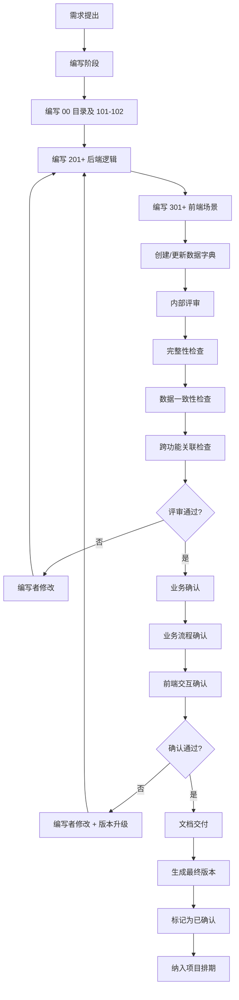
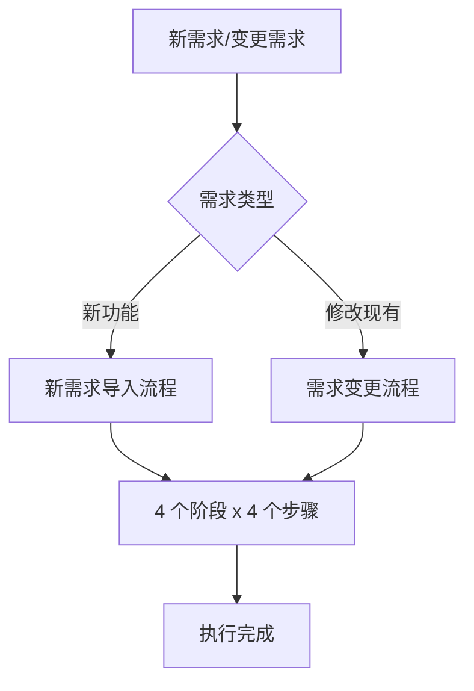
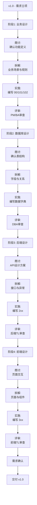
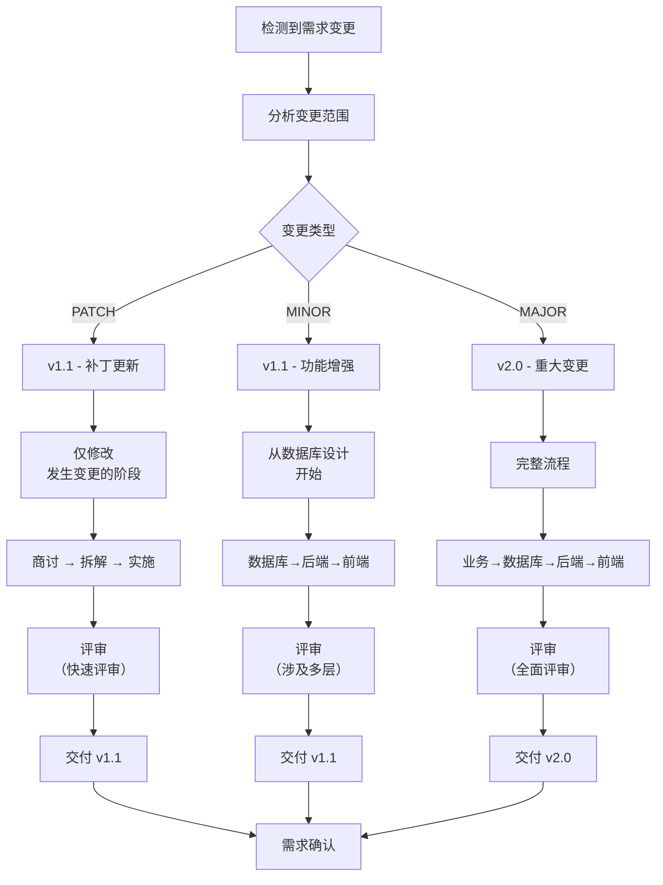

# 需求宪章 (Requirement Charter)

## 总体定位

本宪章专注于**需求确认阶段**的规范与标准，确保需求文档质量、需求评审流程、以及团队协作的有效性。与《项目宪章.md》配合使用——项目宪章针对开发执行阶段，而本宪章针对需求设计与确认阶段。实操细则与模板见《需求规则.md》。

**生效范围**：所有功能需求的设计、文档编写、内部评审、业务确认等阶段

---

## 核心原则

### I. 需求文档模块化与独立引用 - 不可协商

**规则**：
- 每份功能需求必须按编号拆分为多个独立文档，通过引用建立逻辑关联，而非在单一文档中混杂所有内容
- 编号体系为：
  - `00_目录`：汇总所有编号、版本信息、更新日志
  - `101_业务概述`：业务背景、目标、用户、版本
  - `102_流程图`：业务流程、状态流转
  - `2xx_后端逻辑`：后端实现需求，含接口定义与返回包
  - `3xx_前端场景`：前端页面与交互需求
- 各部分通过 Markdown 超链接引用关联，避免重复编写相同内容

**理由**：
模块化拆分解决了需求文档过大、难以维护、内容交错的问题。独立编号便于跨功能引用和版本追踪，当后续数据字典或功能文档建立时，可直接引用而无需重复定义。

---

### II. 数据字典版本管理与变更同步 - 不可协商

**规则**：
- 所有数据表的字典文件必须维护**版本号**（遵循语义化版本：MAJOR.MINOR.PATCH）
- 每个版本需在文件开头的元数据中记录，并在文件末尾维护"版本变更日志"
- 版本变更日志需说明：
  - 变更类型（MAJOR/MINOR/PATCH）
  - 具体变更内容（新增字段、删除字段、字段类型变更等）
  - 变更日期与责任人
  - **影响范围**：涉及哪些需求文档或功能文档需要同步更新
- 当数据字典发生 MAJOR 或 MINOR 版本更新时，自动触发相关需求文档的审查与同步

**理由**：
版本管理确保数据定义的变更可追踪，防止需求与数据库设计脱节。"影响范围"的记录使得维护者能够快速定位需要同步的文档。

---

### III. 后端定义与前端引用 - 不可协商

**规则**：
- **接口由后端定义**：所有 API 接口、参数、返回包（含正常返回 200 和异常返回 400/500 等）均由后端在 `2xx_后端逻辑` 文档中明确定义
- 返回包格式统一为：
  ```json
  // 正常返回 (HTTP 200)
  {
    "code": 200,
    "message": "成功",
    "data": { /* 业务数据 */ }
  }
  
  // 异常返回 (HTTP 400/500)
  {
    "code": 400/500,
    "message": "具体错误描述",
    "data": null
  }
  ```
- **前端引用接口**：`3xx_前端场景` 文档中的页面交互、数据绑定部分，需明确引用对应的后端接口定义
- 引用格式：`[接口描述](../201_后端概述.md#接口名)` 或直接在接口列表中标注接口编码

**理由**：
明确的接口所有权避免前后端沟通成本高、接口定义重复的问题。前端引用后端接口使得设计文档层次清晰，也便于后续实现阶段直接对接。

---

### IV. 需求文档与数据字典的协作模式 - 不可协商

**规则**：
1. **需求优先**：需求文档先确认业务需求，再据此创建或更新数据字典
2. **引用与同步**：
   - 需求中涉及数据操作的部分需明确引用对应的数据表
   - 引用格式：`[表名](../../../dataDict/模块名/表名.md#字段名)`（可选指定具体字段）
3. **变更同步机制**：
   - 若需求变更导致数据字典需更新，须在需求文档中明确标注"数据字典同步需求"
   - 若数据字典变更，需评估并在变更日志的"影响范围"中列出涉及的需求文档
   - 维护者需根据"影响范围"逐一审查并同步相关需求
4. **功能文档的后期集成**（暂未实施）：
   - 当项目建立 `/Doc/function/` 目录存放实现指南时，需求文档应在版本变更日志中引用相关功能文档
   - 数据字典的"影响范围"也应列出功能文档，确保数据定义与实现文档同步

**理由**：
这种协作模式避免了需求与数据设计的反复纠缠，通过明确的引用与变更追踪，确保文档体系的一致性。功能文档的后期集成预留扩展空间，当项目需要补充实现指南时，可直接对接已有的需求与数据字典。

---

### V. 需求评审与交付标准 - 不可协商

**规则**：
- **编写阶段**：
  1. 编写者完成需求文档所有编号部分（00、101、102、2xx、3xx）
  2. 同步编写或更新对应的数据字典文件
  3. 在需求文档的"版本信息"中标注"待评审"状态

- **内部评审**（PM/Tech Lead）：
  1. 检查需求的**完整性**：
     - 所有编号文档是否齐全
     - 业务流程（102）是否与业务概述（101）一致
     - 后端接口（2xx）是否覆盖所有业务场景
     - 前端页面（3xx）是否完整支持业务操作
  2. 检查**数据一致性**：
     - 需求中引用的数据表是否存在且版本正确
     - 需求中使用的字段名与数据字典中的字段名是否一致
     - 数据字典的枚举值与需求中的枚举说明是否一致
  3. 检查**跨功能关联**：
     - 若需求中涉及其他功能的页面跳转或接口调用，是否明确引用了对应功能文档
     - 若涉及新的权限定义，是否在权限配置文档中说明

- **业务确认阶段**（业务方/Product Manager）：
  1. 确认业务需求是否正确理解，特别是流程图（102）和业务规则（2xx 中的业务逻辑部分）
  2. 确认前端交互（3xx）是否符合业务流程
  3. 提出修改意见，由编写者更新文档并增加版本号（至少 PATCH 版本）

- **交付标准**：
  1. 所有编号部分文档完成且无语言错误（简体中文、表达清晰）
  2. 数据字典已创建/更新，版本号与需求对应
  3. 内部评审通过，所有反馈已处理
  4. 业务方确认无误，文档状态更新为"已确认"
  5. 所有超链接、引用路径检查无误

**理由**：
明确的评审与交付标准确保需求质量，同时通过检查清单防止常见问题（如字段名不一致、缺漏跨功能引用等）。

---

### VI. 需求文档的语言与清晰性 - 不可协商

**规则**：
- 所有需求文档必须使用**简体中文**编写，表达清晰准确
- 禁止使用：
  - 繁体字（如"須"应为"需"）
  - 含糊的词汇（如"大概、可能、据说"）
  - 过度缩写或专业术语但未解释
  - 一句多义或语法错误的表述
- 建议使用：
  - "必须、应该、可以、不应该、禁止"等明确词汇
  - 具体的数字、日期、流程步骤而非笼统描述
  - 示例与图表辅助说明复杂逻辑
- 检查清单：
  - [ ] 无繁体字
  - [ ] 关键词解释完整
  - [ ] 业务规则与异常处理明确
  - [ ] 专业术语有注解

**理由**：
清晰的语言是高质量需求的基础，避免了后续实现阶段的理解偏差与返工。

---

### VII. 需求文档的版本控制与变更 - 不可协商

**规则**：
- **版本号格式**：`v主版本.次版本.修订版本`（如 v1.0.0、v1.1.0、v2.0.0）
  - **主版本（MAJOR）**：业务需求重大变更（如核心流程重设计）或接口设计大幅调整
  - **次版本（MINOR）**：新增业务功能或新增接口
  - **修订版本（PATCH）**：文档表述修正、字段说明补充、非结构性调整
- **版本记录位置**：
  - 文档在"版本信息"部分记录版本号与更新日期
  - 在"版本变更日志"部分详细说明各版本的变更内容
- **变更流程**：
  1. 编写者更新文档内容
  2. 根据变更范围确定版本号升级类型
  3. 在版本信息与变更日志中补充记录
  4. 若为 MAJOR 版本，需标记"需数据字典审查"
  5. 通知相关人员（产品、技术、数据库管理员等）同步更新

**理由**：
版本控制使需求的演进过程可追踪，便于回溯决策、定位问题根源、以及评估变更影响。

---

### VIII. 跨功能需求管理 - 不可协商

**规则**：
- **依赖声明**：若需求涉及其他功能的接口或页面，必须在需求文档的对应部分（2xx 或 3xx）明确说明依赖关系
- **引用方式**：
  - 后端依赖：`[功能A的接口X](../功能A文件夹/202_功能A逻辑.md#接口X)`
  - 前端依赖：`[功能B的页面Y](../功能B文件夹/302_功能B场景.md#页面Y)`
- **评审时的检查**：
  - 内部评审需验证所有依赖的功能是否已有对应需求文档
  - 若依赖的功能尚未立项，需标记为"风险项"并在评审记录中说明
- **交付时的完整性检查**：
  - 所有依赖的功能需求均已确认或至少已可预见范围
  - 不允许交付存在"悬空依赖"的需求（即依赖的功能无明确实现计划）

**理由**：
跨功能管理防止需求孤岛，确保系统整体协调。依赖声明与完整性检查在评审阶段就发现潜在风险，避免开发阶段的对接问题。

---

## 需求确认流程



--

## 需求处理执行流程

本章定义了两个核心流程：**新需求导入流程**（从零开始的新功能需求）和**需求变更流程**（对已有需求的修改）。

每个流程分为 **4 个阶段**，每个阶段包含 **4 个步骤**，并按照**执行版本号**组织。所有执行清单和临时文件存放于 `/temp` 文件夹（不纳入版本控制），由用户手动清理。

### 流程总览



---

### 流程 1：新需求导入流程

从功能立项到需求确认的完整流程。包含 4 个阶段，每个阶段 4 个步骤，按版本号（v1.0、v1.1 等）递进。

#### 阶段结构与版本号

新需求导入采用**单一版本号递进**的方式：同一功能的所有阶段共享一个版本号（v1.0），该版本号在需求确认后固定。若需求在后续发生变更，转入"需求变更流程"进行 v1.1、v1.2 等升级。

```
v1.0_新需求导入流程
├─ v1.0_业务设计 (阶段 1)
│  ├─ 商讨
│  ├─ 拆解
│  ├─ 实施
│  └─ 评审
├─ v1.0_数据库设计 (阶段 2)
│  ├─ 商讨
│  ├─ 拆解
│  ├─ 实施
│  └─ 评审
├─ v1.0_后端设计 (阶段 3)
│  ├─ 商讨
│  ├─ 拆解
│  ├─ 实施
│  └─ 评审
└─ v1.0_前端设计 (阶段 4)
   ├─ 商讨
   ├─ 拆解
   ├─ 实施
   └─ 评审
```

#### 详细流程图



#### 每个步骤的输出物

所有执行清单和临时文件存放在 `/temp/[功能名]/v1.0_[阶段名]/` 下。

**业务设计阶段**

| 步骤 | 输入 | 处理方式 | 输出物 | 责任人 |
|------|------|--------|--------|--------|
| **商讨** | 功能需求描述 | 团队讨论定义、目标、用户、限制条件 | `v1.0_业务设计_商讨记录.md` | PM |
| **拆解** | 商讨记录 | 识别业务流程、角色、数据要素、可选性 | `v1.0_业务设计_拆解清单.md` | BA |
| **实施** | 拆解清单 | 编写需求文档 00/101/102，生成初稿流程图 | `/Doc/requirement/[模块]/[功能]/00_目录.md` 等 | 需求编写者 |
| **评审** | 实施产物 | PM/Tech Lead 核查完整性、一致性、可行性 | `v1.0_业务设计_评审意见.md` | PM/Tech Lead |

**数据库设计阶段**

| 步骤 | 输入 | 处理方式 | 输出物 | 责任人 |
|------|------|--------|--------|--------|
| **商讨** | 业务流程、数据要素 | 团队讨论表设计、关系、约束、枚举定义 | `v1.0_数据库设计_商讨记录.md` | DBA/Backend TL |
| **拆解** | 商讨记录 | 分析表间关系、字段清单、索引策略 | `v1.0_数据库设计_拆解清单.md`（包含初稿 SQL）| DBA |
| **实施** | 拆解清单 | 编写数据字典（md 文件），生成最终 SQL | `/Doc/dataDict/[模块]/[表].md` | DBA |
| **评审** | 实施产物 | DBA/数据库负责人 核查规范、性能、一致性 | `v1.0_数据库设计_评审意见.md` | DBA |

**后端设计阶段**

| 步骤 | 输入 | 处理方式 | 输出物 | 责任人 |
|------|------|--------|--------|--------|
| **商讨** | 业务流程、数据结构 | 团队讨论 API 设计、模块划分、依赖关系 | `v1.0_后端设计_商讨记录.md` | Backend TL |
| **拆解** | 商讨记录 | 分析接口、参数、返回包、异常处理 | `v1.0_后端设计_拆解清单.md`（包含接口草稿）| Backend TL |
| **实施** | 拆解清单 | 编写 2xx（201/202+）后端逻辑需求文档 | `/Doc/requirement/[模块]/[功能]/2xx_*.md` | 后端开发 |
| **评审** | 实施产物 | Backend TL 核查接口完整性、异常定义、与数据字典一致性 | `v1.0_后端设计_评审意见.md` | Backend TL |

**前端设计阶段**

| 步骤 | 输入 | 处理方式 | 输出物 | 责任人 |
|------|------|--------|--------|--------|
| **商讨** | 业务流程、后端接口 | 团队讨论页面结构、交互方式、导航关系 | `v1.0_前端设计_商讨记录.md` | Frontend TL |
| **拆解** | 商讨记录 | 分析页面、组件、数据绑定、权限 | `v1.0_前端设计_拆解清单.md`（包含页面草图）| Frontend TL |
| **实施** | 拆解清单 | 编写 3xx（301/302+）前端场景需求文档 | `/Doc/requirement/[模块]/[功能]/3xx_*.md` | 前端开发 |
| **评审** | 实施产物 | Frontend TL/UX 核查交互完整性、与后端接口一致性、用户体验 | `v1.0_前端设计_评审意见.md` | Frontend TL |

#### 门禁条件

**从业务设计进入数据库设计**：
- ✅ 业务设计的所有 4 个步骤已完成
- ✅ 00/101/102 已编写完整
- ✅ PM 和 Tech Lead 的评审意见已处理或明确豁免

**从数据库设计进入后端设计**：
- ✅ 所有数据表的数据字典已编写
- ✅ 初稿 SQL 已通过 DBA 评审
- ✅ 数据字典中的字段名与业务设计中的数据要素一致

**从后端设计进入前端设计**：
- ✅ 所有接口（2xx）已定义，含参数、返回包、异常
- ✅ 接口定义与数据字典的字段名、类型一致
- ✅ Backend TL 的评审意见已处理

**从前端设计进入需求确认**：
- ✅ 所有页面（3xx）的交互设计已编写
- ✅ 页面中的表格列、表单字段与数据字典一致
- ✅ 页面对后端接口的引用正确完整
- ✅ Frontend TL 的评审意见已处理
- ✅ 执行清单中所有检查项已核对完毕

---

### 流程 2：需求变更流程

针对已交付确认的需求（v1.0）进行修改、补充、删除等变更。变更后版本号升级为 v1.1、v1.2（PATCH）或 v2.0（MAJOR）。

需求变更流程采用**增量式执行**：只执行发生变更的阶段，未涉及的阶段可跳过。

#### 变更类型判断

| 变更类型 | 示例 | 新版本号 | 涉及阶段 |
|---------|------|--------|--------|
| **PATCH（文字/注释修改）** | 更正业务说明中的表述错误、补充字段注释 | v1.1 | 发生变更的阶段 + 评审 |
| **MINOR（新增功能/字段）** | 新增接口参数、新增表字段、新增页面 | v1.1 | 数据库设计 → 后端设计 → 前端设计 |
| **MAJOR（流程重设计、接口改变）** | 业务流程重设计、删除接口参数、修改数据表结构 | v2.0 | 业务设计 → 所有后续阶段（完整流程）|

#### 需求变更执行流程



#### 变更流程的 4 个步骤（按需执行）

**PATCH 变更示例**（仅修改后端设计中的一个接口）

| 步骤 | 处理方式 | 输出物 | 责任人 |
|------|--------|--------|--------|
| **商讨** | 团队确认变更的范围与影响 | `v1.1_后端设计_变更商讨.md` | Backend TL |
| **拆解** | 分析变更涉及的接口、参数、返回包 | `v1.1_后端设计_变更拆解.md` | Backend TL |
| **实施** | 更新 2xx 文档中的对应接口定义，更新版本号 | `/Doc/requirement/.../2xx_*.md` (v1.1) | 后端开发 |
| **评审** | Backend TL 核查变更内容的正确性与完整性 | `v1.1_后端设计_变更评审.md` | Backend TL |

**MINOR 变更示例**（新增一个表字段和对应的 API 参数）

| 步骤 | 涉及阶段 | 处理方式 | 输出物 | 责任人 |
|------|--------|--------|--------|--------|
| **商讨** | 数据库+后端 | 确认新字段定义、API 参数映射 | `v1.1_数据库设计_商讨.md` / `v1.1_后端设计_商讨.md` | DBA / Backend TL |
| **拆解** | 同上 | 分析字段详情、参数结构 | `v1.1_数据库设计_拆解.md` / `v1.1_后端设计_拆解.md` | DBA / Backend TL |
| **实施** | 同上 | 更新数据字典、2xx 文档 | `/Doc/dataDict/.../表.md` (v1.1) / `2xx_*.md` (v1.1) | DBA / 后端 |
| **评审** | 同上 | DBA 和 Backend TL 分别评审 | `v1.1_数据库_评审.md` / `v1.1_后端_评审.md` | DBA / Backend TL |

可选：前端如需支持新参数，也需执行前端设计的相应步骤。

**MAJOR 变更示例**（业务流程重设计）

执行完整的 4 阶段流程，版本号升级为 v2.0：

```
v2.0_需求变更流程（MAJOR）
├─ v2.0_业务设计
├─ v2.0_数据库设计
├─ v2.0_后端设计
└─ v2.0_前端设计
```

#### 变更后的版本号同步

需求文档中的版本号应保持一致：

- 00 目录：记录最新版本（v1.1、v2.0 等）
- 101 业务概述：更新版本信息
- 2xx/3xx：文件名可保持不变，但内容中的版本号更新为最新版本
- 数据字典：相关表文件的版本号同步更新

---

## 常见问题与预防

### 常见误区

1. **需求文档过于冗长**
   - ❌ 将所有内容在单一文档中混写
   - ✅ 按编号拆分，各文档专注于自己的职责

2. **数据字典与需求内容重复**
   - ❌ 在需求中重新定义表结构
   - ✅ 需求中只引用数据字典，必要时在需求中补充业务规则说明

3. **后端接口定义不清**
   - ❌ 接口参数与返回包在前端或需求中才确定
   - ✅ 后端在 2xx 文档中完整定义接口，包括异常返回

4. **跨功能引用缺失**
   - ❌ 需求中提到其他功能但未明确引用
   - ✅ 所有跨功能引用都有完整的 Markdown 链接

5. **数据字典变更未同步**
   - ❌ 更新数据字典但忘记更新相关需求
   - ✅ 在数据字典版本日志中明确"影响范围"，并由维护者同步相关需求

---

## 治理规则

### 宪章地位
- 需求宪章是需求确认阶段的最高规范，所有需求评审与交付必须遵循本宪章
- 若需求宪章与项目宪章在职责划分上有冲突，需求宪章优先适用于需求阶段

### 修订流程
1. 提出修订意见 → 评估影响范围 → 团队讨论 → 2/3 以上同意即可修订
2. 运行修订后，同步更新相关流程文档（如评审检查清单）
3. 通知全体及时了解新规范

### 版本控制
- **v1.0**：初始版本，基于项目现状制定

---

**版本**: v1.1  
**制定日期**: 2025-12-17  
**最后更新**: 2025-12-17  
**适用范围**: JSEComplex 项目需求确认阶段  
**下次审查**: 2025-12-31（或在有 MAJOR 版本修订后）

**v1.1 更新内容**：
- 新增需求处理执行流程章节
- 定义新需求导入流程（4 阶段 x 4 步骤）
- 定义需求变更流程（增量式执行，按变更类型区分）
- 建立临时文件管理机制（`/temp` 文件夹）
